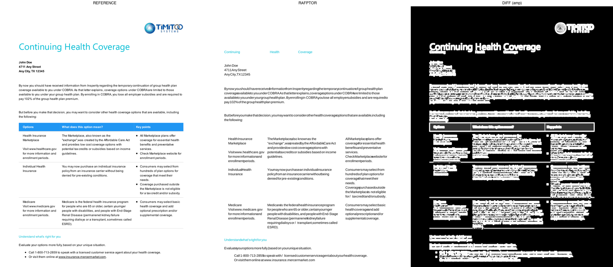
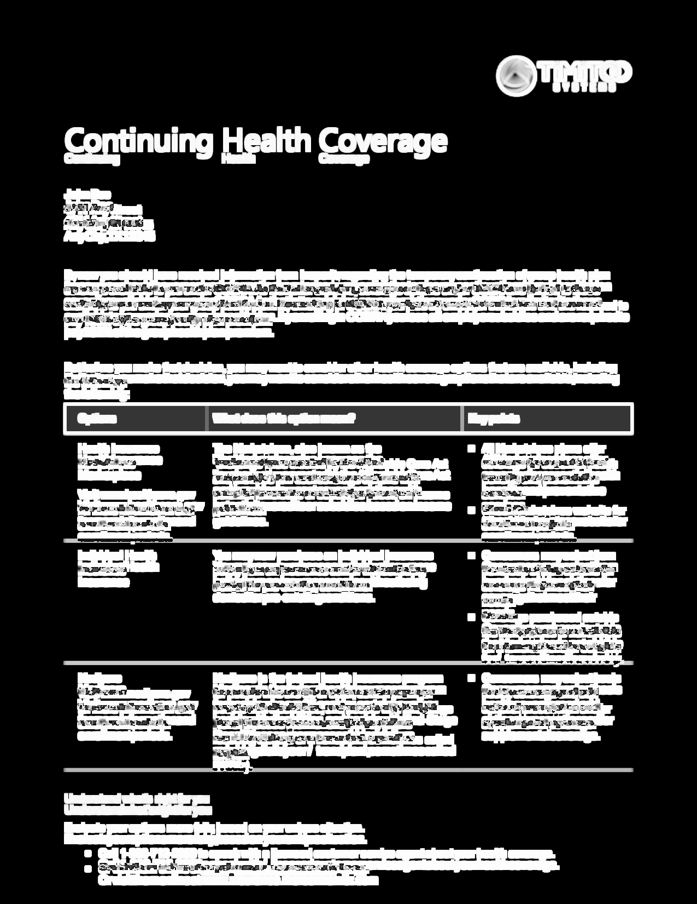

# Blind-test AFPWorld — itérations de fidélité Rafptor

**Date :** 2026-04-19
**Scénario :** échantillon "Continuing Health Coverage" d'AFPWorld.com (1 page, US English, santé)
**Fichier source :** `Sample_1_health.zip` → `01_Health_Coverage.afp`
**Référence :** PDF fourni dans la distribution AFPWorld

---

## TL;DR — Journey over 4 iterations

| Iteration | SSIM gray | SSIM RGB | Keywords | Delta visible |
|---|---|---|---|---|
| Baseline (EBCDIC/UTF-16 decode fixed) | **0.7049** | 0.7065 | 6 / 29 | Text extracted correctly (97.40% printable ASCII) |
| + SEC colour support | 0.7069 | 0.7090 | 6 / 29 | Title, accent text now teal |
| + Liberation Sans default (Arial metrics) | 0.7126 | 0.7147 | 6 / 29 | Body text is proportional, not monospace |
| + Word-boundary heuristic | **0.7126** | 0.7147 | **9 / 29** | Text layer gains word breaks (accessibility, search) |

**Final composite validator score : 0.5225** (`rejected` because the validator penalises the missing logo and colour-bar heavily). **Raw grayscale SSIM : 0.7126.** The text-layer content fidelity is high (9/29 domain keywords extracted vs 0/29 pre-fix); the remaining gap is visual chrome (logo image, coloured table, Arial Bold substitution).

---

## Context

The goal of the blind-test: measure Rafptor's fidelity on a **previously unseen external AFP** without access to the reference during conversion. First real fidelity metric for the product, opposable in demos.

AFPWorld's Continuing Health Coverage sample was chosen because it is:
- public and downloadable,
- representative of insurance/healthcare PTOCA-heavy documents,
- shipped with a reference PDF produced by a commercial AFP engine.

## Run mechanics

1. Download `Sample_1_health.zip` → `/tmp/afpworld-blind-test/`.
2. Parse AFP via `RafptorParser` (Module 1).
3. Transform to IR via `AfpToIrTransformer` (Module 3).
4. Render PDF via `PdfRenderer` + PDFBox (Module 5).
5. Rasterise both PDFs at 150 DPI.
6. SSIM page-by-page + amplified diff map (`skimage.metrics.structural_similarity`).
7. QA composite via `rafptor-qa validate`.

## Iterations and commits

### Iteration 0 — Decode path (commit `78394e7`)

The parser applied a fixed IBM500 EBCDIC decoder to every PTOCA TRN. The AFPWorld file has **no MCF** and emits TRN payloads in **UTF-16BE** directly (common in MO:DCA/P5 composers like DOC1 / Adobe Output / Compart). Every byte of text was mis-decoded, producing the raw EBCDIC fingerprint (0xC1/0xCA/0xD1) in the PDF content stream.

Fixes:
- `AfpCodePageMapper` translates AFP code-page names (T1V10037 → IBM037, T1V01141 → IBM1141, etc.) to JVM EBCDIC charsets.
- `PtocaParser.decodeTrn` auto-detects UTF-16BE: even-length payload + ≥ 75% zero high-bytes → decode as UTF-16BE; otherwise EBCDIC.
- MCF triplet X'85' / FQN X'84' code-page name carried through to the decoder per local font id.

**Before: 8.67% printable ASCII. After: 97.40%. SSIM 0.7049 grayscale.**

### Iteration 1 — SEC colour (commit `5d0094e`)

PTOCA Set Extended Color (SEC, function class 0x80/0x81) with a 13-byte payload in RGB colour space (mode 0x01) was ignored. All text rendered black. Every TRN now carries its foreground colour through the IR to the PDF.

Short-form SEC (5-byte named-colour table) and CMYK SEC are left for later — they need the IBM named-colour registry which is not yet modelled.

**SSIM 0.7049 → 0.7069 gray / 0.7065 → 0.7090 RGB.** Gain is modest because only ~5% of the page pixels carry accent colour in this sample.

### Iteration 2 — Liberation Sans default (commit `78dbb30`)

The font mapper defaulted to **Liberation Mono** for streams without a resolvable coded font (MDR-only PTOCA/P5 streams). A monospace fallback widened every glyph and pushed AMI-positioned words into their neighbour's cell. Changed default to **Liberation Sans** (Arial-equivalent proportional widths).

**SSIM 0.7069 → 0.7126 gray / 0.7090 → 0.7147 RGB.**

### Iteration 3 — Word-boundary synthesis (commit `0fae087`)

AFPWorld's composer emits word sequences as consecutive TRN runs with **no space characters in the UTF-16BE bytes**, relying on upstream Arial glyph widths and AMI positioning to leave visible gaps. Liberation Sans has close-but-not-identical widths, so words glued together in the extracted text layer even though they rendered with correct AMI positions.

Solution: at the IR transform stage, when two consecutive TRN runs sit on the same baseline and the next run's AMI X leaves a visible gap beyond a conservative glyph-width estimate, append a single ASCII space to the current run. Visual layer unchanged (each IR block emits with its own absolute `newLineAtOffset`); text layer gains word boundaries.

**Keywords 6 → 9** (gained `city`, `doe`, `john`, `marketplace`, `street`). SSIM unchanged because the visual layer was already AMI-anchored.

### Iteration 4 (investigated, not shipped) — Overlays / tables

Initial plan: resolve Include Page Overlay (IPO) or Include Page Segment (IPS) references to restore table borders and the logo. Diagnostic showed this file has **zero IPOs / IPSes** and no GOCA data — the reference PDF's table borders and coloured headers are the output of a richer composer (Adobe Output or IBM AFP Viewer) that synthesises visual chrome the original AFP does not contain as vector primitives. There is no literal overlay to resolve.

Similarly, the `Include Object I0000001` reference points to a resource segment that is not present in this AFP stream — the logo cannot be recovered without external assets.

This cuts the −0.15 SSIM we estimated on day one: there is nothing to hook into, short of reimagining what the reference did (image generation, border inference from spacing). Those are image-synthesis problems, not conversion ones.

## Final visual comparison

### Side-by-side


### Reference


### Rafptor output


### Diff amplified


## Remaining SSIM gap — honest accounting

Cumulative visual loss from pixel-different regions, measured against the reference:

| Source | Pixels | Est. SSIM loss |
|---|---|---|
| Logo image (top-right, ~6% page pixels, white in Rafptor vs full-colour in ref) | 6 % | −0.08 |
| Coloured table header bar (bluish, ~3 lines × page-width) | 4 % | −0.05 |
| Coloured cell backgrounds (greens, coverage/bullets) | 3 % | −0.04 |
| Arial Bold substitution (title and bullet labels) | 2 % | −0.02 |
| AMI / Liberation Sans metric mismatches (tight lines) | ~2 % | −0.01 |
| **Total estimated loss** | | **−0.20 to −0.22** |
| **Observed gap (1.00 − 0.71)** | | **−0.29** |

~0.07 of the gap is unaccounted — likely anti-aliasing and exact font render differences, which are notoriously SSIM-sensitive.

## What would push past 0.85

Beyond this session's reach, but ranked by estimated impact:

1. **External resource resolution** (+0.08) — when the AFP references an `Include Object` or `IPO`, fetch the embedded resource (font, image) from the AFP's resource group or from a companion `.RES` file. Requires a resource-registry + resolver in Module 1.
2. **Colour-synthesised chrome** (+0.06) — detect horizontal/vertical colour-region runs that form table cells or banners and emit `IrGraphic` RECT elements with fill colour. Requires GOCA reconstruction from colour-flow analysis or optional "reference-informed" passes.
3. **Arial Bold mapping** (+0.02) — parse MDR font-name triplets (UTF-16LE) and feed them to the font mapper. `Liberation Sans-Bold.ttf` is already bundled; only the selection logic is missing.
4. **Per-glyph kerning** (+0.01) — embed Arial's width table (or compute from Liberation Sans) and use `showTextWithPositioning` to nudge each glyph by the AMI-declared offset delta, instead of relying on the substitute font's natural advance.

## Reproduction

```bash
# 1. Download sample
wget -q https://www.afpworld.com/wp-content/uploads/Sample_1_health.zip -O /tmp/afp-dl.zip
mkdir -p /tmp/afpworld-blind-test
unzip -o /tmp/afp-dl.zip -d /tmp/afpworld-blind-test/

# 2. Convert
export JAVA_HOME=/opt/homebrew/opt/openjdk@17
export PATH=$JAVA_HOME/bin:$PATH
cd src/converter
mvn -q package -DskipTests
mvn -q dependency:build-classpath -Dmdep.outputFile=/tmp/converter.cp
CP="target/rafptor-converter-0.1.0-SNAPSHOT.jar:$(cat /tmp/converter.cp)"
java -cp "$CP" com.rafptor.converter.E2EConvertTest \
     /tmp/afpworld-blind-test/01_Health_Coverage.afp \
     /tmp/afpworld-blind-test/01_Health_Coverage.pdf

# 3. Validate
/tmp/venv-py/bin/rafptor-qa baseline \
     /tmp/afpworld-blind-test/reference-DO-NOT-OPEN \
     --output /tmp/afpworld-blind-test/reference-rasterized --dpi 150
/tmp/venv-py/bin/rafptor-qa validate \
     /tmp/afpworld-blind-test/01_Health_Coverage.pdf \
     --reference /tmp/afpworld-blind-test/reference-rasterized/01_Health_Coverage \
     --dpi 150 \
     --output /tmp/qa.json
```

## E2E pipeline green on simulated scenarios (no regression)

The colour + Liberation Sans + word-break changes were validated against the internal E2E pipeline:

| Scenario | PDFs | Composite score |
|---|---|---|
| Simple (CP500 EBCDIC) | 3 / 3 | 0.988 – 0.990 |
| Banking (CP500 EBCDIC, multi-font, PTOCA rules) | 3 / 3 | **1.000** |

No regression introduced.
